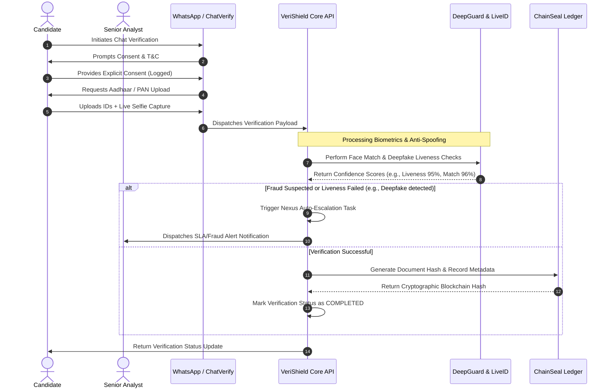

# 🛡️ VeriShield - Employee Background Verification Platform


<h3 align="center">VeriShield</h3>

<p align="center">
  <strong>Next-Generation AI-Driven Background Verification & Fraud Prevention Platform</strong>
</p>

<p align="center">
  <a href="https://github.com/VortexQuasarX/Verishield"></a>
  <a href="https://github.com/VortexQuasarX/Verishield/issues"></a>
  
  
</p>

---

## 📖 Overview

**VeriShield** is an advanced, corporate-grade candidate background verification platform engineered to eradicate identity spoofing, credential fabrication, and candidate substitution. By combining **biometric AI engines**, **interactive automated messaging**, and a **cryptographic ledger**, VeriShield guarantees tamper-proof verification pipelines for high-trust hiring environments.

Standard screening platforms depend on delayed, manual, and error-prone document reviews. VeriShield introduces **automated candidate interaction**, **real-time deepfake audio/video checks**, and **blockchain-anchored proof of verification**—all consolidated under a sleek, modern administration control center.

---

## ⚡ Core Capabilities

VeriShield is built on five pillars of verification intelligence:

### 1. 👁️ DeepGuard AI™ (Liveness & Deepfake Prevention)
* **Real-Time Spoofing Detection**: Automatically checks for video replay attacks, printed photos, 3D masks, and pre-recorded video feeds during candidates' submissions.
* **Deepfake Detection Engine**: Identifies AI-generated video and audio modifications using advanced neural patterns, outputting a clear, actionable **Deepfake Score** (fraud index).
* **Tab-Switch & Proctor Monitoring**: Logs anti-cheating events (e.g., candidate leaving the verification window) to flag potential external assistance or screen recording.

### 2. 💬 ChatVerify™ (WhatsApp Bot Simulator)
* **Automated Data Harvesting**: Conducts candidate chat workflows resembling a WhatsApp conversation. Collects user consent, personal details, and digital documents seamlessly.
* **Interactive Document Verification Requests**: Automatically guides candidates to re-submit blurred or invalid documents in real-time, removing bottlenecks from manual operations.

### 3. 🆔 LiveID Engine™ (Biometric & Document Cross-Matching)
* **High-Accuracy Face Matching**: Conducts biometric mapping between the live capture selfie and the photo on official government IDs (Aadhaar Card, PAN Card, etc.).
* **Document Authenticity Assessment**: Performs structural, text-alignment, and watermark verification on uploaded cards to confirm government issuing standards.

### 4. 🔗 ChainSeal™ Ledger (Cryptographic Integrity)
* **Tamper-Proof Audit Trail**: Anchors completed verification details (candidate data, completion dates, and approval logs) as SHA-256 cryptographic hashes.
* **Verifiable Hashes**: Generates an immutable blockchain ledger hash for each completed verification, proving records have not been altered or falsified retrospectively.

### 5. 🤖 Nexus AI™ (Autonomous SLA & Escalate Orchestrator)
* **Auto-Escalation Routines**: Instantly flags high-risk applications (e.g., Deepfake Score > 80% or biometric mismatch) and re-allocates them to Senior Compliance Managers.
* **Predictive SLA Breach Monitor**: Continuously forecasts processing delays based on active analyst pipelines and automatically alerts coordinators to optimize throughput.

---

## 🏗️ System Architecture

VeriShield uses a **dual-framework hybrid architecture**. It combines a **Next.js (React) App Router** as the core backend, main user dashboard, and API hub, with a fully modular **Angular Client-Side App** configured to serve specific micro-services and user modules seamlessly.

### Stack Breakdown
* **Core Framework**: Next.js 16 (App Router, TailwindCSS, Radix UI/Shadcn)
* **Module Framework**: Angular 21 (Modular dashboard panels & micro-apps)
* **ORM Layer**: Prisma Client v6 (SQLite database configuration)
* **Database**: SQLite (Highly efficient local transactional storage)
* **Script Compiler**: `tsx` (Seamless execution of TypeScript seeding & scripts)


---

## 🔄 Candidate Verification Pipeline

The diagram below maps the complete lifecycle of a verification workflow from candidate onboarding to final ledger writing.



---

## 🗄️ Database Schema & Data Models

VeriShield organizes its records through SQLite using Prisma. Here is an overview of the core entities and their functions:

| Data Model | Key Parameters | Functionality |
| :--- | :--- | :--- |
| **`User`** | `email`, `name`, `password`, `role`, `isActive` | Manages login credentials and system privileges (e.g., `admin`, `analyst`). |
| **`VerificationRecord`** | `verificationId`, `company`, `riskLevel`, `chainHash` | Represents the candidate's core case and links to the cryptographic hash. |
| **`ChatSession`** / **`ChatMessage`** | `candidatePhone`, `consentGiven`, `documentsUploaded` | Captures individual ChatVerify candidate text logs, consent, and media links. |
| **`DeepGuardCheck`** | `confidenceScore`, `deepfakeScore`, `faceMatchScore` | Stores biometric confidence markers, cheating alerts, and anti-spoof logs. |
| **`LiveIDRecord`** | `idNumber`, `antiSpoofScore`, `checkPassed` | Archives the results of photo comparisons against government documents. |
| **`NexusTaskRecord`** | `type` (`auto_escalation`, `sla_monitoring`), `progress` | Coordinates behind-the-scenes system task scheduling and task outputs. |
| **`Notification`** | `userId`, `title`, `message`, `type` (`error`, `warning`) | Feeds instant status and threat alerts into the analyst user interface. |
| **`ActivityLog`** | `action`, `details`, `category` (`auth`, `verification`) | Maintains an immutable operational audit log for platform users. |

---

## 🚀 Getting Started

Deploy and run a fully configured local instance of VeriShield by following these steps.

### Prerequisites
Make sure **Node.js** (v20+) and **NPM** (v10+) are installed.

### 1. Repository Setup & Dependencies
Clone the repository and install dependencies for the Next.js core application and the Angular application:
```bash
# Install root core dependencies
npm install

# Install Angular-specific dependencies
cd angular-app
npm install
cd ..
```

### 2. Database Synchronization & Client Generation
Build the local SQLite database from the Prisma schema and compile the Prisma client:
```bash
# Push schema changes to SQLite db
npx prisma db push
```

### 3. Populating Demo Records
Seed the SQLite database with multi-tier test data (Candidate sessions, deepfake metrics, liveness logs):
```bash
# Run the TS seed file using tsx
npx tsx prisma/seed.ts
```

### 4. Compiling the Angular Front-End
Generate the static production build of the Angular app (the generated static assets will build straight into the Next.js public directory at `/public/angular`):
```bash
# Build the Angular app output
cd angular-app
npm run build
cd ..
```

### 5. Running the Application
Start the Next.js development server locally:
```bash
# Start development server
npm run dev
```
Open **[http://localhost:3000](http://localhost:3000)** in your browser to explore the dashboard.

---

## 📈 Future Enhancements Roadmap

* **💻 Multi-Tenant Portals**: Add isolated client organization spaces allowing HR agencies to request verifications in isolated environments.
* **🎥 Interactive Live Proctoring**: Enable real-time remote-guided video interviews equipped with instant head-orientation and eye-tracking metrics.
* **🌍 International Identity Docs**: Extend LiveID OCR extraction to passports, residency permits, and driver's licenses globally.
* **🔒 Hardware Security Modules (HSM)**: Add physical HSM integrations to lock and stamp ChainSeal hashes with military-grade security.

---

<p align="center">
  Built with ❤️ by the <strong>VeriShield Development Team</strong>.
</p>
