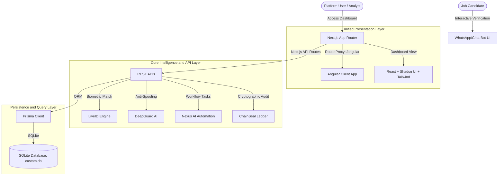
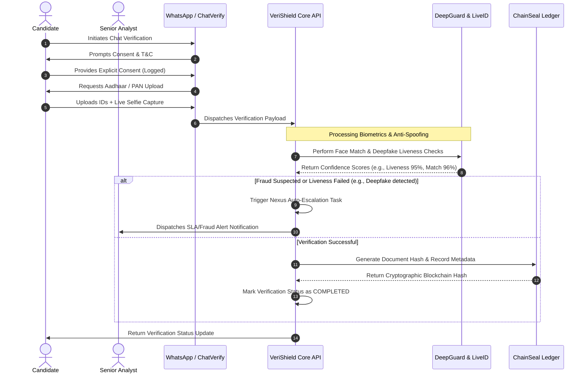

# 🛡️ VeriShield - AI Background Verification Platform

<p align="center">
  <strong>Next-Generation AI-Driven Background Verification & Fraud Prevention Platform</strong>
</p>

<p align="center">
  <a href="https://github.com/VortexQuasarX/Verishield"></a>
  <a href="https://github.com/VortexQuasarX/Verishield/issues"></a>
  
  
</p>

---

## 📖 Overview

**VeriShield** is a state-of-the-art employee background verification platform designed to eliminate identity fraud, credentials falsification, and candidate impersonation. By utilizing real-time biometric AI engines, automated communication channels, and secure cryptographic ledger hashes, VeriShield builds trust into hiring pipelines.

VeriShield replaces standard slower screening with **autonomous document gathering**, **proactive deepfake liveness audits**, and **tamper-proof blockchain validation**—all managed inside a clean, modern control interface.

---

## ⚡ Core Capabilities

VeriShield operates on five core modules of verification intelligence:

### 1. 👁️ DeepGuard AI™ (Liveness & Deepfake Prevention)
* **Active Anti-Spoofing**: Defeats replay attacks, digital photos, physical paper masks, and virtual camera feeds.
* **Deepfake Scanner**: Processes audio and video feeds to discover synthetically modified voices or faces, outputting a dynamic **Deepfake Score** (fraud index).
* **Proctor Monitoring**: Tracks and flags window tab-switching, frame departures, and multiple faces to prevent cheating.

### 2. 💬 ChatVerify™ (WhatsApp Bot Simulator)
* **Automated Collection**: Conducts automated WhatsApp-style conversational interviews to collect consent, credentials, and identity documents.
* **Instant Resubmissions**: Detects low-quality or blurry documents and requests instant high-resolution uploads.

### 3. 🆔 LiveID Engine™ (Biometrics Cross-Matching)
* **Face Comparison**: Measures biometric coordinates between the candidate's live selfie and their official government-issued ID card.
* **Integrity Audits**: Evaluates government documents (Aadhaar Card, PAN Card, etc.) for text misalignment, watermark discrepancies, or structural anomalies.

### 4. 🔗 ChainSeal™ Ledger (Cryptographic Trust)
* **SHA-256 Anchoring**: Hashes candidate verification statuses and metrics into immutable strings.
* **Immunity From Modification**: Generates a verifiable blockchain ledger hash for each completed verification, proving records haven't been tampered with.

### 5. 🤖 Nexus AI™ (Self-Healing Automation)
* **Auto-Escalation Engine**: Instantly flags verifications containing deepfake risks or biometric mismatch and re-allocates them to Senior Analysts.
* **SLA Breach Predictor**: Evaluates overall analyst processing queues to forecast delays and automatically recommend workload optimization.

---

## 🆚 VeriShield vs. Legacy Platforms

| Feature Capabilities | 🛡️ VeriShield Platform | ❌ Traditional Platforms |
| :--- | :--- | :--- |
| **Verification Speed** | **Instant (Minutes)** | Manual Review (Days to Weeks) |
| **Fraud Prevention** | **DeepGuard AI Video Liveness & Deepfake Auditing** | None (Static files accepted) |
| **Identity Matching** | **LiveID Biometric Face & Document OCR Matching** | Eye-ball review (High error rate) |
| **Audit Trails** | **ChainSeal Cryptographic Ledger (SHA-256)** | Modifiable central SQL log rows |
| **Data Collection** | **ChatVerify Interactive Chat Interface** | Long forms & clunky portal screens |
| **Risk Escalation** | **Nexus AI Autonomous Queue Auto-Escalation** | Manual escalation reviews |

---

## 🏗️ System Architecture & Workflow

VeriShield uses a **dual-framework hybrid architecture** where **Next.js 16 (React)** serves as the API backend, main analytics dashboard, and route router, while **Angular 21** handles client-side views inside `/public/angular` on unified endpoints.

### Unified Presentation Layout



### Verification Pipeline Lifecycle



---

## 📂 Project Directory Structure

Below is an overview of the directories and files within the hybrid platform:

```ascii
VeriShield/
├── angular-app/                # Angular Frontend Application (Module framework)
│   ├── src/                    # Angular TypeScript source code
│   │   ├── app/                # Main Angular app modules and components
│   │   │   ├── admin/          # Administration panels
│   │   │   ├── dashboard/      # Analytic charts
│   │   │   └── chatverify/     # Candidate interactive chat verify client
│   │   └── environments/       # Environment files for production & local setups
│   ├── angular.json            # Angular Workspace Configuration (builds to root /public/angular)
│   ├── package.json            # Angular dependencies
│   └── tsconfig.json           # Angular TypeScript rules
├── prisma/                     # Database Configuration Layer
│   ├── schema.prisma           # Prisma Data Model Declarations (SQLite dialect)
│   └── seed.ts                 # TS Database Seeding Script (Generates mock records)
├── public/                     # Public Directory & Static Asserts
│   ├── angular/                # [Ignored] Automatically compiled Angular bundle
│   └── logo.svg                # System branding asset
├── src/                        # Next.js Application Source (Core Layer)
│   ├── app/                    # Next.js App Router (React pages & API Routes)
│   │   ├── angular/            # Middleware proxy routes to compile and proxy Angular views
│   │   ├── api/                # REST endpoints folder
│   │   │   ├── deepguard/      # DeepGuard AI processing APIs
│   │   │   ├── liveid/         # Biometric and identity analysis APIs
│   │   │   └── nexus/          # Nexus background worker controller APIs
│   │   ├── layout.tsx          # Application shell layout
│   │   └── page.tsx            # Main authentication & entryway router page
│   ├── components/             # React View Components (Shadcn + Tailwind)
│   │   ├── ui/                 # Atomic design design components
│   │   └── shared/             # Global dashboard metrics, views, and navigation drawers
│   ├── hooks/                  # React Custom Hooks
│   ├── lib/                    # Library Initializations (Prisma client, Encryption store, etc.)
│   └── types/                  # TypeScript Global Type definitions
├── .env                        # [Ignored] Database and backend keys
├── .gitignore                  # Git Ignore configuration
├── bun.lock                    # Bun package dependency lock
├── package.json                # Root package configuration (includes Next.js dev scripts)
└── tsconfig.json               # Root TypeScript layout configuration
```

---

## 🗄️ Database Schema & Models

| Data Model | Key Parameters | Functionality |
| :--- | :--- | :--- |
| **`User`** | `email`, `name`, `password`, `role`, `isActive` | Account model for administrators, audit personnel, and client users. |
| **`VerificationRecord`** | `verificationId`, `company`, `riskLevel`, `chainHash` | Represents a candidate background check profile locked by a hash. |
| **`ChatSession`** / **`ChatMessage`** | `candidatePhone`, `consentGiven`, `documentsUploaded` | Capture candidates' active chat responses, consent values, and files. |
| **`DeepGuardCheck`** | `confidenceScore`, `deepfakeScore`, `faceMatchScore` | Biometric results, cheating metrics, liveness details, and cheating triggers. |
| **`LiveIDRecord`** | `idNumber`, `antiSpoofScore`, `checkPassed` | Archives scanning results of verified official documents. |
| **`NexusTaskRecord`** | `type` (`auto_escalation`, `sla_monitoring`), `progress` | Manages operational state and output files of background processes. |
| **`Notification`** | `userId`, `title`, `message`, `type` (`error`, `warning`) | Direct alerts on security hazards or completed actions. |
| **`ActivityLog`** | `action`, `details`, `category` (`auth`, `verification`) | Tracks dashboard user actions for historical accountability audits. |

---

## 🔌 REST API Documentation

### 1. Authentication
* **`POST /api/auth/login`**
  * **Payload**: `{"email": "admin@verishield.com", "password": "secure-password"}`
  * **Response**: `200 OK` with session cookie and user metadata.

### 2. Biometric Verification
* **`POST /api/liveid/analyze`**
  * **Payload**: `{"selfieBase64": "...", "documentBase64": "...", "documentType": "aadhaar"}`
  * **Response**:
    ```json
    {
      "checkPassed": true,
      "faceMatchScore": 96.7,
      "idMatchScore": 98.2,
      "livenessScore": 94.5
    }
    ```

### 3. Anti-Spoofing & Deepfake Detection
* **`POST /api/deepguard/analyze`**
  * **Payload**: `{"videoUrl": "..."}`
  * **Response**:
    ```json
    {
      "status": "flagged",
      "deepfakeScore": 87.3,
      "confidenceScore": 42.1,
      "alerts": "Fraud suspected — Ananya Desai interview (87.3% fraud score)"
    }
    ```

### 4. Background Automations
* **`GET /api/nexus/tasks`**
  * **Response**: Returns a collection of automated system monitoring, auto-escalations, and SLA monitoring tasks.

---

## 🔑 Environment Setup

Create a `.env` file in the root directory:

```env
# Database Dialect URL (SQLite relative to prisma schema)
DATABASE_URL="file:../db/custom.db"

# System Ports (Used by standard services)
PORT=3000

# Authentication Secret (Used by security tokens)
NEXTAUTH_SECRET="a-very-long-and-highly-secure-secret-key"
```

---

## 🛠️ CLI Quick Start

| Command | Action | Description |
| :--- | :--- | :--- |
| `npm install` | **Dependencies** | Installs backend and dev package components. |
| `cd angular-app && npm install && cd ..` | **Frontend Setup** | Installs client-side frontend package dependencies. |
| `npx prisma db push` | **Database Push** | Synchronizes SQLite database with current models. |
| `npx tsx prisma/seed.ts` | **Seeding Records** | populates SQLite with mock sessions and verifications. |
| `npm run build` | **Compiles Bundle** | Builds Angular and compiles the Next.js static output. |
| `npm run dev` | **Local Execution** | Launches the Next.js localhost application on port `3000`. |

---

## 📈 Future Enhancements Roadmap

* **💻 Multi-Tenant Portals**: Add isolated client organization spaces allowing HR agencies to request verifications in isolated environments.
* **🎥 Interactive Live Proctoring**: Enable real-time remote-guided video interviews equipped with instant head-orientation and eye-tracking metrics.
* **🌍 International Identity Docs**: Extend LiveID OCR extraction to passports, residency permits, and driver's licenses globally.
* **🔒 Hardware Security Modules (HSM)**: Add physical HSM integrations to lock and stamp ChainSeal hashes with military-grade security.

---

<p align="center">
  Built with ❤️ by the <strong>VeriShield </strong>.
</p>
